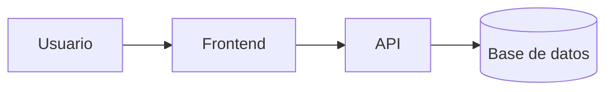

# Tienda de Calzado Urbano


Proyecto para el control de inventario y venta de calzado deportivo y urbano.

## Tabla de contenidos

- [Descripción](#descripción)
- [Instalación](#instalación)
- [Uso](#uso)
- [Estado de funcionalidades](#estado-de-funcionalidades)
- [Pendientes](#pendientes)
- [Arquitectura](#arquitectura)
- [Contribuidores](#contribuidores)

## Descripción

Este proyecto permite registrar productos, filtrar calzado por tallas y gestionar pedidos en linea para clientes.

## Instalación

```bash
git clone https://github.com/martinmamaniv/laboratorio-readme.git
cd laboratorio-readme
```

## Uso

```bash
code .
```

## Estado de funcionalidades

| Función               | Estado      |
|-----------------------|-------------|
| Catalogo de productos | Listo       |
| Carrito de compras    | En progreso |
| Pasarela de pago      | Pendiente   |

## Pendientes
- [x] Registro de modelos de calzado
- [ ] Modulo de facturacion
## Arquitectura

## Contribuidores

- Mamani Villacrez, Martin Alfredo - [Martin](https://github.com/martinmamaniv)